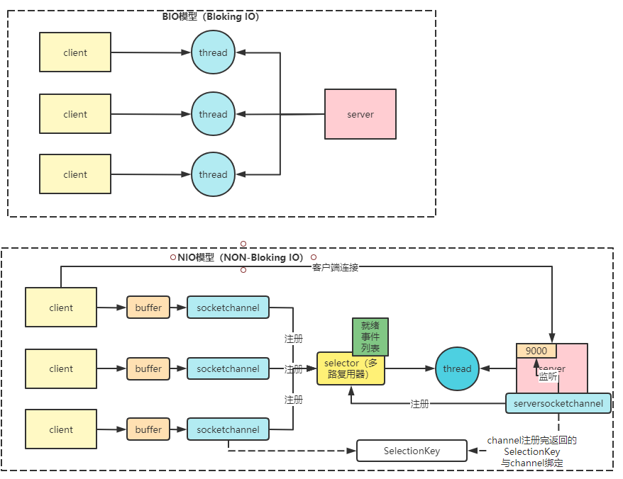
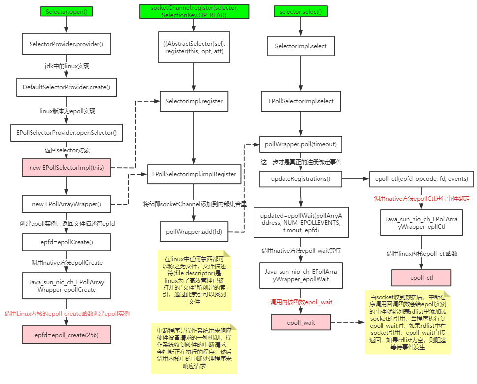
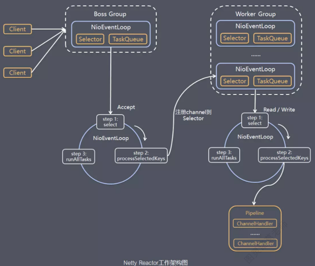
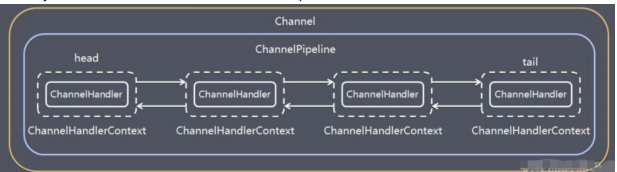

        
### NIO
1. NIO三大核心组件：Channel(通道)、Buffer(缓冲区)、Selector(多路复用器）
   * channel类似于流，每个channel对应一个buffer缓冲区，buffer底层就是个数组
   * channel会注册到selector上，由selector根据channel读写时间的发生将其交由某个空闲的线程处理
   * NIO的Buffer和channel都是既读也可写
2. Nio的三个关键方法（以下为linux内实现，windows不支持epoll，底层是基于winsock2的select函数实现）
   * Selector.open：创建多路复用器，本质上是调用linux的epoll_create函数来创建epoll
   * socketChannel.register(selector, SelectionKey.OP_READ)：将channel注册到多路复用器上
   * selector.selector：阻塞等待需要处理的事件发生，其内部通过epoll_ctl来进行事件绑定以及通过epoll_wait函数阻塞等待事件发生
   
3. EPoll函数
   * epoll_create
   ``` 
    int epoll_create(int size)
    创建一个epoll实例，并返回一个非负数作为文件描述符，用于对epoll接口的后续调用，参数size代表可能会size个描述符，但size不是一
    个最大值，只是提示操作系统它的数量级，现在这个参数基本上已经弃用了
   ```
   * epoll_ctl
   ``` 
    int epoll_ctl(int epfd, int op, int fd, struct epoll_event *event)
    使用文件描述符epfd引用的epoll实例对目标文件描述符fd执行op操作
    参数epfd表示epoll实例对应的文件表述符，参数fd表示socket对应的文件描述符
    参数op有一下几个值：
        EPOLL_CTL_ADD：注册新的fd到epfd中，并关联事件event
        EPOLL_CTL_MOD：修改已经注册的fd的监听事件
        EPOLL_CTL_DEL：从epfd中移除fd，并且忽略掉绑定的event，这是event可以为null
    参数event是一个结构体，其有很多可选值如EPOLLIN（表示对应的文件描述符是可读的）、EPOLLOUT（表示对应的文件描述符设计可写的）、EPOLLERR（表示对应的文件描述符发生了错误）
     struct epoll_event {
        __uint32_t events; /* Epoll events */
        epoll_data_t data; /* User data variable */
        };
    
     typedef union epoll_data {
         void *ptr;
         int fd;
         __uint32_t u32;
         __uint64_t u64;
     } epoll_data_t;
   ```
   * epoll_wait
   ``` 
    int epoll_wait(int epfd, struct epoll_event *events, int maxevents, int timeout)
    等待文件描述符epfd上的时间，events表示调用者所有可用事件的集合，maxevents表示最多等到多少个事件就返回，timeout是超时时间
   ```
### AIO
在linux上AIO的底层实现仍使用EPoll，没有很好实现AIO，因此在性能上没有明显的优势，而且被JDK封装了一层不容易深度优化，Linux上AIO还不够成熟，所以Netty选择了NIO而非AIO，
但是Netty是异步非阻塞框架，其在NIO上做了很多异步的封装
### Netty
1. Netty线程模型
   
   * Netty抽象出两组线程池BossGroup和WorkerGroup，前者撞门负责接收客户端的连接，后者专门负责网络的读写
   * BossGroup和WorkerGroup类型都是NioEventLoopGroup
   * NioEventLoopGroup相当于一个事件循环线程组，这个组中含有多个事件循环线程，每一个事件循环线程是NioEventLoop
   * 每个NioEventLoop都有一个selector，用于监听注册在其上的socketChannel的网络通讯
   * 每个Boss NioEventLoop线程内部循环执行的步骤有三步
     * 处理accept事件，与client建立连接，生成NioSocketChannel
     * 将NioSocketChannel注册到某个worker NioEventLoop上的selector
     * 处理任务队列的任务即runAllTasks
   * 每个Worker NioEventLoop线程循环执行的步骤
     * 轮询注册到自己selector上的所有NioSocketChannel的read，write事件
     * 处理I/O事件，即read，write事件，在对应NioSocketChannel处理业务
     * runAllTasks处理任务队列TaskQueue的任务，一些耗时的业务处理一般可以放在TaskQueue中慢慢处理，这样不影响数据在pipeLine中的流动处理
   * 每个worker NioEventLoop处理NioSocketChannel业务时，会使用pipeline（管道），管道中维护了很多handler处理器用来处理channel中的数据
2. Netty模块组件
   * BootStrap、ServerBootstrap：Bootstrap意思为引导，一个Netty应用通常由一个Bootstrap开始，主要作用是配置整个Netty程序，串联各个组件，
   Netty中Bootstrap类是客户端程序的启动引导类，ServerBootstrap是服务端启动引导类
   * Future、ChannelFuture：在Netty中所有的I/O操作都是异步的，不能立刻得知消息是否被正确处理，但是可以过一会等它执行完或直接注册一个监听，
   具体实现就是通过Future和ChannelFuture，他们可以注册一个监听，当操作执行成功或失败时监听会自动触发注册的监听事件
   * Channel：Netty网络通信的组件，能够用于执行网络I/O操作，其为用户提供：
     * 当前网络连接的通道的状态
     * 网络连接的配置参数
     * 提供异步的网络I/O操作，异步调用意味着任何I/O调用都将立即返回，并且不保证在调用结束时所有请求的I/O操作已完成
     * 调用立即返回一个ChannelFuture实例，通过注册监听器到ChannelFuture上，可以I/O操作成功、失败或取消回调通知调用方
     * 支持关联I/O操作与对应的处理程序
     * 不同协议、不同的阻塞类型的连接有不同的Channel类型与之对应
     ``` 
      常用的Channel类型：
      NioSocketChannel，异步的客户端TCP Socket连接
      NioServerSocketChannel，异步的服务器端TCP Socket连接
      NioDatagramChannel，异步的UDP连接
      NioSctpChannel，异步的客户端Sctp连接
      NioSctpServerChannel，异步的Sctp服务器连接
     ```
   * Selector：Netty基于Selector对象实现I/O多路复用，通过Selector一个线程可以监听多个连接的Channel事件。当一个Selector中注册Channel后，Selector内部的机制
   就可以自动不断地查询（Select）这些注册的Channel是否有已就绪的I/O事件。
   * NioEventLoop：NioEventLoop中维护了一个线程和任务队列，支持一部提交执行任务，线程启动时会调用NioEventLoop的run方法，执行I/O任务和非I/O任务。I/O任务即SelectionKey中ready的时间，如
   accept、connect、read、write等，由processSelectedKeys方法触发。非I/O任务是添加到taskQueue中的任务，如register()、bind()等任务，有runAllTasks方法触发
   * NioEventLoopGroup：主要管理eventLoop的生命周期，可以理解为一个线程池，内部维护了一组线程，每个线程负责处理多个Channel上的时间，而一个Channel只对应于一个线程
   * ChannelHandler：其是一个接口，处理I/O事件或拦截I/O操作，并将其转发到其ChannelPipeline（业务处理链）中的下一个处理程序。ChannelHandler本身并没有提供很多方法，因为这个接口有许多的方法
   需要实现，方便使用起见可以继承它的子类：ChannelInboundHandler（用于处理入站I/O事件）、ChannelOutboundHandler（用于处理出站I/O操作）。或者使用适配器类：ChannelInboundHandlerAdapter（
   用于处理入站I/O事件）、ChannelOutboundHandlerAdapter用于处理出站I/O操作
   * ChannelHandlerContext：保存Channel相关的上下文信息，同时关联一个ChannelHandler对象
   * ChannelPipeline：保存ChannelHandler的List，用于处理或拦截Channel入站事件和出站操作，其实现了一种高级形式的拦截过滤器模式，使用户可以完全控制事件的处理方式，以及Channel中各个的
   ChannelHandler如何交互。在Netty中每个Channel都有且仅有一个ChannelPipeLine与之对应。
   
   一个 Channel 包含了一个 ChannelPipeline，而 ChannelPipeline 中又维护了一个由 ChannelHandlerContext 组
   成的双向链表，并且每个 ChannelHandlerContext 中又关联着一个 ChannelHandler。
   read事件(入站事件)和write事件(出站事件)在一个双向链表中，入站事件会从链表 head 往后传递到最后一个入站的
   handler，出站事件会从链表 tail 往前传递到最前一个出站的 handler，两种类型的 handler 互不干扰。
### ByteBuf
   1. ByteBuf由一串字节数组构成，数组中每个字节用来存放信息，其提供两个索引，一个用于读取数据，一个用于写入数据。这里两个索引通过在字节数组中移动来定位需要读或写信息的位置
   2. 当从ByteBuf读取时，她的readerIndex将会根据读取的字节数递增。同样当写ByteBuf时，它的writerIndex也会根据写入的字节数进行递增
   3. 当readerIndex刚好读到了WriterIndex写入的地方为极限情况，一旦超过，Netty会抛出IndexOutOfBoundsException异常
