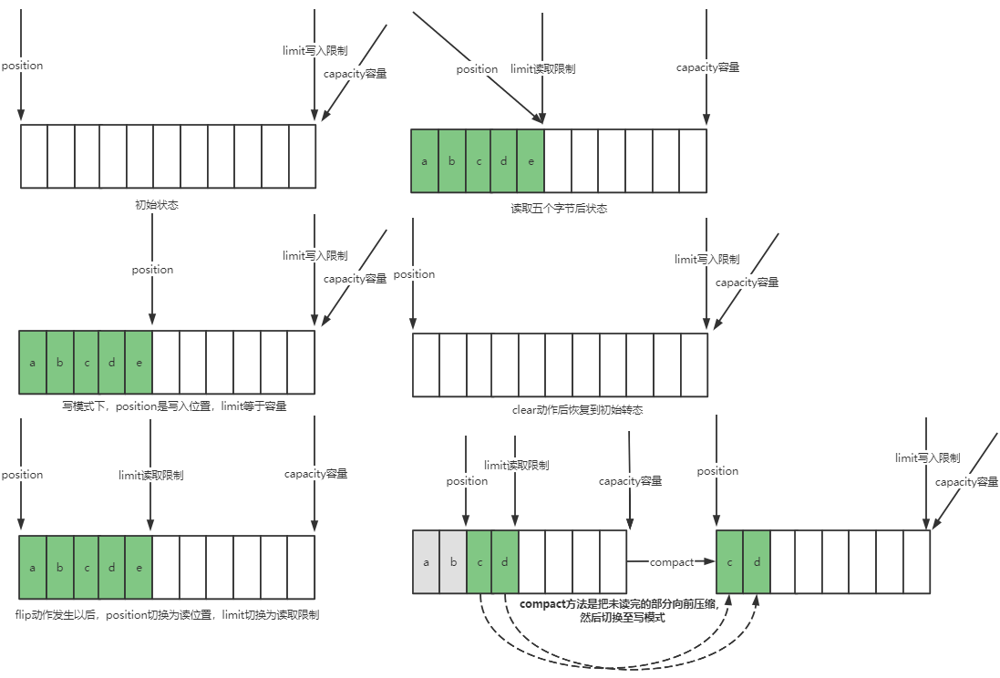

1. ByteBuffer有以下重要属性
   * capacity：容量
   * position：当前指针位置
   * limit：读写限制                 
                    
2. ByteBuffer常用方法
   * allocate()：分配java堆内存，此方法容量无法动态调整，读写效率低，收到GC的影响
   * allocateDirect()：分配直接内存，读写效率高（少一次拷贝），不会受GC影响，分配效率低且使用不当的话会造成内存泄漏
   * 向buffer写入数据：
     * 调用channel的read方法：`int readBytes = channel.read(buf)`
     * 调用buffer自己的put方法：`buf.put((byte) 127)`
   * 从buffer读取数据
     * 调用channel的write方法：`int wreteBytes = channel.write(buf)`
     * 调用buffer自己的get方法：`byte b = buf.get()`，get方法会是position读指针向后走，如果想要重复读取数据可以使用
       * rewind方法将position重新置为0
       * 调用get(int i)方法获取索引i的内容，它不会移动读指针
       * mark和reset方法来恢复到标记的位置
   * bytebuffer转换方法
     * 字符串转为ByteBuffer：`buffer.put("hello".getBytes)`
     * 使用charset将字符串转换为ByteBuffer，此方法会自动将buffer切换为读模式：`StandardCharsets.UTF_8.encode("hello")`
     * 使用wrap也可以直接切换为读模式：`ByteBuffer.wrap("hello".getBytes(StandardCharsets.UTF_8))`
     * ByteBuffer转为字符串：`StandardCharsets.UTF_8.decode(buffer).toString()`
   * 分散读取，将内容分散读取到多个buffer中
     ``` 
         try (FileChannel channel = new RandomAccessFile("data.txt", "r").getChannel()) {
            ByteBuffer buffer1 = ByteBuffer.allocate(3);
            ByteBuffer buffer2 = ByteBuffer.allocate(3);
            ByteBuffer buffer3 = ByteBuffer.allocate(3);

            channel.read(new ByteBuffer[]{buffer1, buffer2, buffer3});
            buffer1.flip();
            buffer2.flip();
            buffer3.flip();
            ByteBufferDebugUtil.debugAll(buffer1);
            ByteBufferDebugUtil.debugAll(buffer2);
            ByteBufferDebugUtil.debugAll(buffer3);
        } catch (IOException e) {
        }
     ```
   * 集中写
     ``` 
        ByteBuffer buffer1 = StandardCharsets.UTF_8.encode("hello");
        ByteBuffer buffer2 = StandardCharsets.UTF_8.encode("world");
        ByteBuffer buffer3 = StandardCharsets.UTF_8.encode("你好");

        try (FileChannel chanel = new RandomAccessFile("data.txt", "rw").getChannel()) {
            chanel.write(new ByteBuffer[]{buffer1, buffer2, buffer3});
        } catch (IOException e) {
        }
     ```
3. 黏包半包
   网络上有多条数据发送给服务端，数据之间使用\n进行分隔，但是由于某种原因哲哲数据在接收时被进行了重新组合，例如
   ``` 
      Hello,world\n
      I`m zhangsan\n
      How are you?\n
   变成了下面的两个bytebuffer（黏包、半包）
      Hello,world\nI`m zhangsan\nHo
      w are you?\n
   ```
   * 黏包发声的原因是因为客户端为了发送效率到一定量数据之后再统一发送
   * 半包主要是由服务端的缓冲区大小决定的，当缓冲区大小不够就要等第二次再接收了
   * 我们可以使用limit、position、compact()来解决此问题
   ``` 
       source.flip();

        for (int i = 0; i < source.limit(); i++) {
            // 找到一条完整消息
            if (source.get(i) == '\n') {
                // 把完整消息存入新的ByteBuffer
                int length = i + 1 - source.position();
                ByteBuffer target = ByteBuffer.allocate(length);

                // 从source读，向target写
                for (int j = 0; j < length; j++) {
                    target.put(source.get());
                }
                ByteBufferDebugUtil.debugAll(target);
            }
        }

        // 没处理完的留着跟下次的合并再处理
        source.compact();
   ```
