### 概述
1. 网络的网络：网络把主机连接起来，而互联网是把多种不同的网络连接起来，因此互联网是网络的网络，且其实全球范围的互连网。
2. ISP（Internet service provider）    
  互联网服务提供商ISP可以从互联网管理机构获得许多ip地址，同时拥有通信线路及路由器等设备，个或机构向ISP缴纳一定的费用就可以接入互联网。   
  目前的互联网是一种多层次ISP结构，ISP根据覆盖范围的大小分为第一层ISP、区域ISP和接入ISP。互联网交换点IXP允许两个ISP直接连接而不用经过第三个ISP。   
  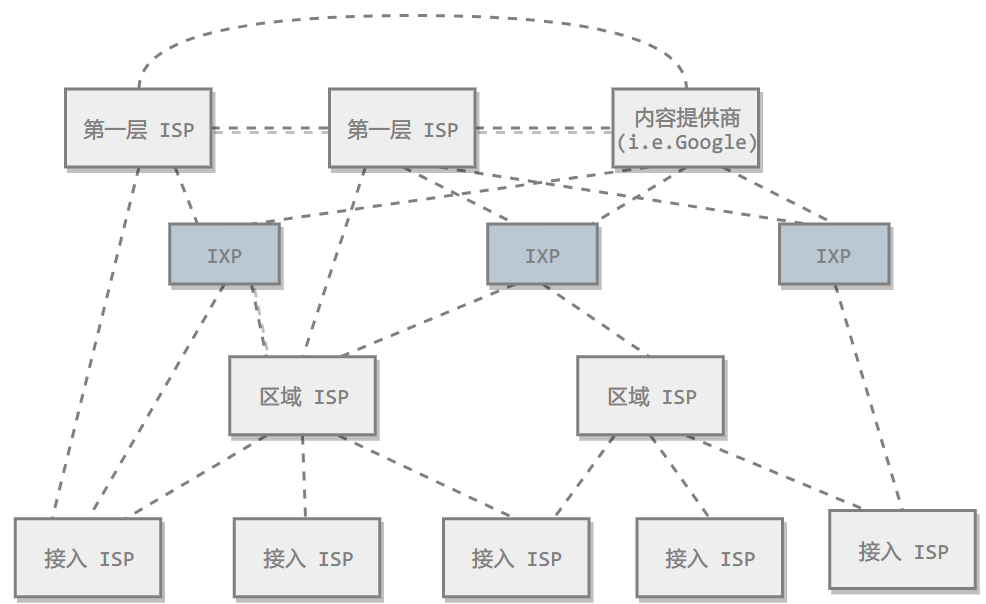    
3. 主机之间的通信方式   
   * 客户-服务器（C/S）：客户是服务的请求方，服务器是服务的提供方    
     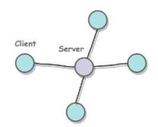   
   * 对等（P2P）：不区分客户和服务器   
     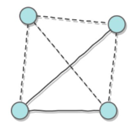  
4. 电路交换与分组交换
   * 电路交换  
     电路交换用于电话通信系统，两个用户要通信之前需要建立一条专用的物理链路，并且在整个通信过程中始终占用该链路。由于通信的过程中不可能一直在使用传输线路，因此电路交换对线路的利用率很低。
   * 分组交换  
     每个分组都有首部和尾部，包含了源地址和目的地址等控制信息，在同一个传输线路上同时传输多个分组互相不影响，因此在同一条传输线路上允许同时传输多个分组，也就是说分组交换不需要占用传输线路。  
     例如在一个邮局系统中，邮局收到一份邮件之后，先存储下来，然后把相同目的地的邮件一起转发到下一个目的地，这个过程就是存储转发过程，分组交换也使用了存储转发过程。
5. 时延：总时延=排队时延+处理时延+传输时延+传播时延  
    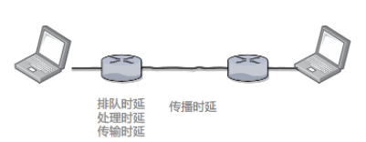   
    * 排队时延：分组在路由器输入队列和输出队列排队等待的时间，取决于网络当前的通信量
    * 处理时延：主机或路由器收到分组时进行处理所需要的时间，例如分析首部、从分组中提取数据、进行差错检验或查找适当的路由等
    * 传输时延：主机或路由器传输数据帧所需要的时间
    * 传播时延：电磁波在信道中传播所需要花费的时间，电磁波传播的速度接近于光速  
6. 计算机网络体系结构  
    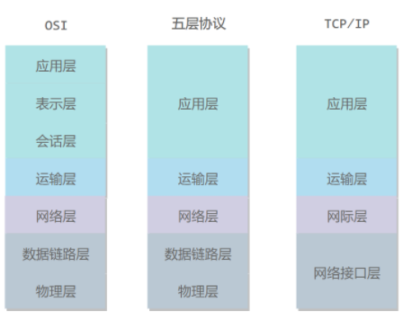   
    * 五层协议
      * 应用层：为特定引用程序提供数据传输服务，例如HTTP、DNS等协议，数据单位为报文
      * 运输层：为进程提供通用数据传输服务。由于应用层协议很多，定义通用的传输层协议就可以支持不断增加的应用层协议。运输层包括两种协议：传输控制协议TCP，提供面向连接、可靠的数据传输服务，数据单位为报文段；用户数据报协议UDP，提供无连接、尽最大努力交付的数据传输服务，数据单位为用户数据报。TCP主要提供完整性服务，UPD主要提供及时性服务
      * 网络层：为主机提供数据传输服务。而传输层协议是为主机中的进程提供数据传输服务。网络层把传输层传递下来的报文段或用户数据报封装成分组
      * 数据链路层：网络层针对的还是主机之间的数据传输服务，而主机之间可以有很多链路，链路层协议就是为同一条链路的主机提供数据传输服务。数据链路层把网络层传递下来的分组封装成帧。
      * 物理层：考虑的是怎样在传输媒体上传输数据比特流，而不是具体的传输媒体。物理层的作用是尽可能屏蔽传输媒体和通信手段的差异，使数据链路层感觉不到这些差异。
    * OSI:七层协议，五层协议没有表示层和会话层，其将这些功能交由应用程序开发者处理，用途如下
      * 表示层：数据压缩、加密以及数据描述，这使得应用程序不必关心在各台主机中数据内部格式不同的问题
      * 会话层：建立及管理会话
    * TCP/IP：它只有四层，相当于五层协议中数据链路层和物理层合并为网络接口层。TCP/IP体系结构不严格遵循OSI分层概念，应用层可能会直接使用IP层或者网络接口层。  
      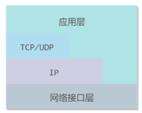
    * 数据在各层之间的传递过程：在向下的过程中，需要添加下层协议所需要的首部和尾部，而在向上的过程中不断拆开首部和尾部。  
      路由器只有下面三层协议，因为路由器位于网络核心中，不需要为进程或者应用程序提供服务，因此也就不需要传输层和应用层。
### 物理层
1. 通信方式
    根据信息在传输线路上的传送方向，分为以下三种通信方式：  
     * 单工通信：单向传输
     * 半双工通信：双向交替传输
     * 全双工通信：双向同事传输
2. 带通调制：模拟信号是连续的信号，数字信号是离散的信号，带通调制把数字信号转换为模拟信号  
    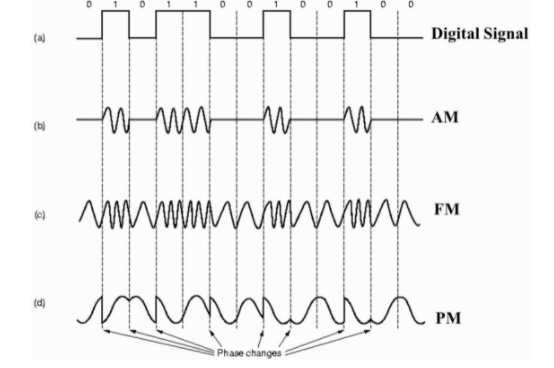  
### 数据链路层
1. 基本问题
   * 分装成帧：将网络层传下来的分组添加首部和尾部，用于标记帧的开始和结束。
       
   * 透明传输：透明表示一个实际存在的事物看起来好像不存在一样。帧使用首部和尾部进行定界，如果帧的数据部分含有和首部尾部相同的内容，那么帧的开始和结束位置就会被错误的判定。需要在数据部分出现首部尾部相同的内容前面插入转义字符。如果数据部分出现转义字符，那么就在转义字符前面再加个转义字符。在接收端进行处理之后可以还原出原始数据。这个过程透明传输的内容是转义字符，用户察觉不到转义字符的存在。  
     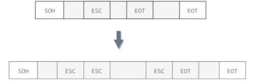  
   * 差错检测：目前数据链路层广泛使用了循环冗余检验（CRC）来检查比特差错。
2. 信道分类
   * 广播信道：一对多通信，一个节点发送的数据能够被广播信道上所有的节点接收到。所有的节点都在同一个广播信道上发送数据，因此需要有专门的控制方法进行协调，避免发生冲突（冲突也叫碰撞）。主要有两种控制方法进行协调，一个是使用信道复用技术，一是使用 CSMA/CD 协议。
   * 点对点信道：一对一通信。因为不会发生碰撞，因此也比较简单，使用 PPP 协议进行控制。
3. 信道复用技术
   * 频分复用：频分复用的所有主机在相同的时间占用不同的频率带宽资源。  
     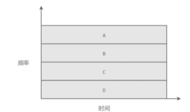  
   * 时分复用：时分复用的所有主机在不同的时间占用相同的频率带宽资源。使用频分复用和时分复用进行通信，在通信的过程中主机会一直占用一部分信道资源。但是由于计算机数据的突发性质，通信过程没必要一直占用信道资源而不让出给其它用户使用，因此这两种方式对信道的利用率都不高。  
     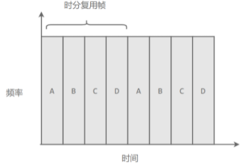  
   * 统计时分复用：是对时分复用的一种改进，不固定每个用户在时分复用帧中的位置，只要有数据就集中起来组成统计时分复用帧然后发送。  
     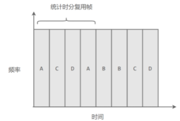  
   * 波分复用：光的频分复用。由于光的频率很高，因此习惯上用波长而不是频率来表示所使用的光载波。
   * 码分复用
4. PPP协议：互联网用户通常需要连接到某个 ISP 之后才能接入到互联网，PPP 协议是用户计算机和 ISP 进行通信时所使用的数据链路层协议。  
   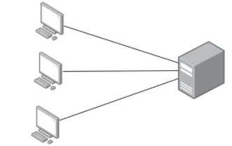  
    ppp的帧格式：
     * F 字段为帧的定界符  
     * A 和 C 字段暂时没有意义
     * FCS 字段是使用 CRC 的检验序列
     * 信息部分的长度不超过 1500  
     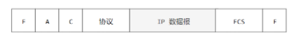  
5. mac地址：MAC 地址是链路层地址，长度为 6 字节（48 位），用于唯一标识网络适配器（网卡）。一台主机拥有多少个网络适配器就有多少个 MAC 地址。例如笔记本电脑普遍存在无线网络适配器和有线网络适配器，因此就有两个 MAC 地址。
### 网络层
网络层是整个互联网的核心，因此应当让网络层尽可能简单。网络层向上只提供简单灵活的、无连接的、尽最大努力交互的数据报服务。使用 IP 协议，可以把异构的物理网络连接起来，使得在网络层看起来好像是一个统一的网络。  
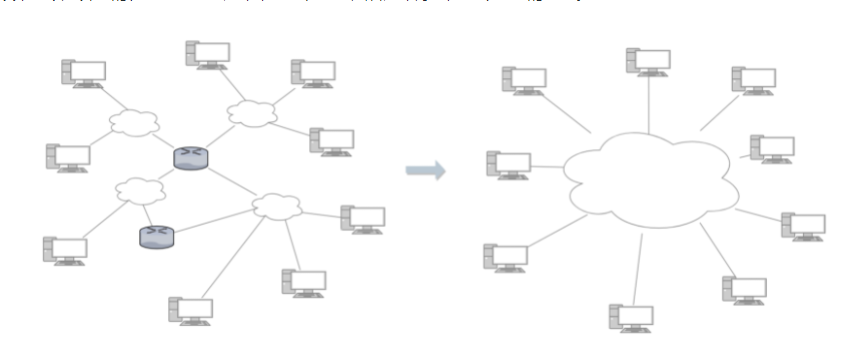  
1. ip数据报格式  
  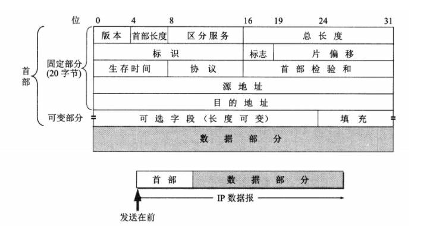
  * 版本号：有 4（IPv4）和 6（IPv6）两个值
  * 首部长度： 占 4 位，因此最大值为 15。值为 1 表示的是 1 个 32 位字的长度，也就是 4 字节。因为固定部分长度为 20 字节，因此该值最小为 5。如果可选字段的长度不是 4 字节的整数倍，就用尾部的填充部分来填充。
  * 区分服务：用来获得更好的服务，一般情况下不使用。
  * 总长度：包括首部长度和数据部分长度。
  * 生存时间：TTL，它的存在是为了防止无法交付的数据报在互联网中不断兜圈子。以路由器跳数为单位，当 TTL 为 0 时就丢弃数据报。
  * 协议：指出携带的数据应该上交给哪个协议进行处理，例如 ICMP、TCP、UDP 等。
  * 首部校验和：因为数据报每经过一个路由器，都要重新计算检验和，因此检验和不包含数据部分可以减少计算的工作量。
  * 标识：在数据报长度过长从而发生分片的情况下，相同数据报的不同分片具有相同的标识符。
  * 片偏移：和标识符一起，用于发生分片的情况。片偏移的单位为 8 字节。  
    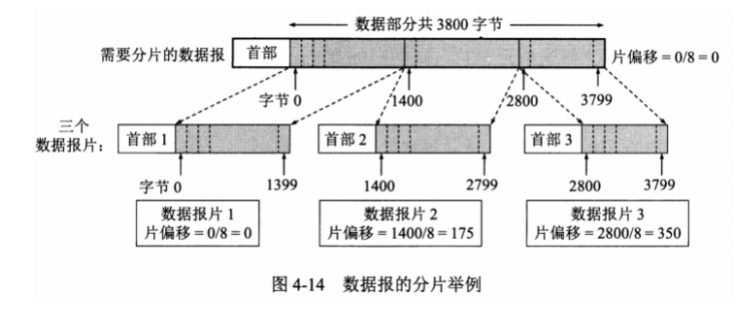
### 传输层
1. UDP和TCP的特点
    * 用户数据报协议 UDP（User Datagram Protocol）是无连接的，尽最大可能交付，没有拥塞控制，面向报文（对于应用程序传下来的报文不合并也不拆分，只是添加 UDP 首部），支持一对一、一对多、多对一和多对多的交互通信。
    * 传输控制协议 TCP（Transmission Control Protocol）是面向连接的，提供可靠交付，有流量控制，拥塞控制，提供全双工通信，面向字节流（把应用层传下来的报文看成字节流，把字节流组织成大小不等的数据块），每一条 TCP 连接只能是点对点的（一对一）。
2. UPD首部格式：首部字段只有 8 个字节，包括源端口、目的端口、长度、检验和。12 字节的伪首部是为了计算检验和临时添加的。  
    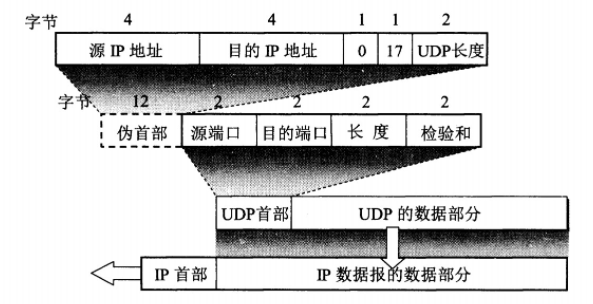  
3. TCP首部格式  
    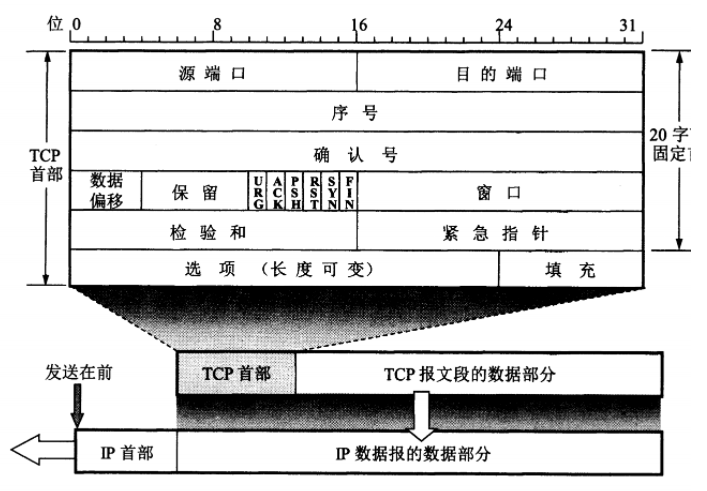  
    * 序号：用于对字节流进行编号，例如序号为 301，表示第一个字节的编号为 301，如果携带的数据长度为 100 字节，那么下一个报文段的序号应为 401。
    * 确认号：期望收到的下一个报文段的序号。例如 B 正确收到 A 发送来的一个报文段，序号为 501，携带的数据长度为 200 字节，因此 B 期望下一个报文段的序号为 701，B 发送给 A 的确认报文段中确认号就为 701。
    * 数据偏移量：指的是数据部分距离报文段起始处的偏移量，实际上指的是首部的长度。
    * 确认ACK：当 ACK=1 时确认号字段有效，否则无效。TCP 规定，在连接建立后所有传送的报文段都必须把 ACK 置 1。
    * 同步SYN：在连接建立时用来同步序号。当 SYN=1，ACK=0 时表示这是一个连接请求报文段。若对方同意建立连接，则响应报文中 SYN=1，ACK=1。
    * 终止FIN：用来释放一个连接，当 FIN=1 时，表示此报文段的发送方的数据已发送完毕，并要求释放连接。
    * 窗口：窗口值作为接收方让发送方设置其发送窗口的依据。之所以要有这个限制，是因为接收方的数据缓存空间是有限的。
4. TCP三次握手  
  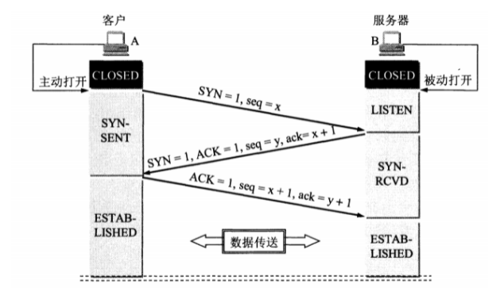    
假设 A 为客户端，B 为服务器端。  
   * 首先 B 处于 LISTEN（监听）状态，等待客户的连接请求。
   * A 向 B 发送连接请求报文，SYN=1，ACK=0，选择一个初始的序号 x。
   * B 收到连接请求报文，如果同意建立连接，则向 A 发送连接确认报文，SYN=1，ACK=1，确认号为 x+1，同时也选择一个初始的序号 y。
   * A 收到 B 的连接确认报文后，还要向 B 发出确认，确认号为 y+1，序号为 x+1。
   * B 收到 A 的确认后，连接建立。  
三次握手的原因：  
     第三次握手是为了防止失效的连接请求到达服务器，让服务器错误打开连接。客户端发送的连接请求如果在网络中滞留，那么就会隔很长一段时间才能收到服务器端发回的连接确认。客户端等待一个超时重传时间之后，就会重新请求连接。但是这个滞留的连接请求最后还是会到达服务器，如果不进行三次握手，那么服务器就会打开两个连接。如果有第三次握手，客户端会忽略服务器之后发送的对滞留连接请求的连接确认，不进行第三次握手，因此就不会再次打开连接。
5. TCP 的四次挥手  
   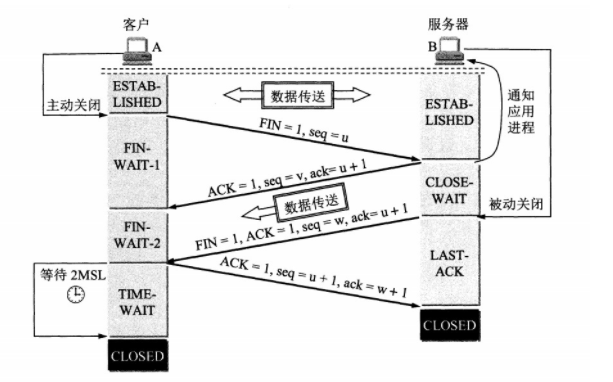   
   以下描述不讨论序号和确认号，因为序号和确认号的规则比较简单。并且不讨论 ACK，因为 ACK 在连接建立之后都为 1。
   * A 发送连接释放报文，FIN=1。
   * B 收到之后发出确认，此时 TCP 属于半关闭状态，B 能向 A 发送数据但是 A 不能向 B 发送数据。
   * 当 B 不再需要连接时，发送连接释放报文，FIN=1。
   * A 收到后发出确认，进入 TIME-WAIT 状态，等待 2 MSL（最大报文存活时间）后释放连接。
   * B 收到 A 的确认后释放连接。  
   四次挥手的原因：  
     客户端发送了 FIN 连接释放报文之后，服务器收到了这个报文，就进入了 CLOSE-WAIT 状态。这个状态是为了让服务器端发送还未传送完毕的数据，传送完毕之后，服务器会发送 FIN 连接释放报文。  
   TIME_WAIT：  
     客户端接收到服务器端的 FIN 报文后进入此状态，此时并不是直接进入 CLOSED 状态，还需要等待一个时间计时器设置的时间 2MSL。这么做有两个理由：确保最后一个确认报文能够到达。如果 B 没收到 A 发送来的确认报文，那么就会重新发送连接释放请求报文，A 等待一段时间就是为了处理这种情况的发生；等待一段时间是为了让本连接持续时间内所产生的所有报文都从网络中消失，使得下一个新的连接不会出现旧的连接请求报文。
6. TCP 可靠传输：TCP 使用超时重传来实现可靠传输：如果一个已经发送的报文段在超时时间内没有收到确认，那么就重传这个报文段。一个报文段从发送再到接收到确认所经过的时间称为往返时间 RTT
7. TCP 流量控制：流量控制是为了控制发送方发送速率，保证接收方来得及接收。接收方发送的确认报文中的窗口字段可以用来控制发送方窗口大小，从而影响发送方的发送速率。将窗口字段设置为 0，则发送方不能发送数据。
8. TCP 拥塞控制：如果网络出现拥塞，分组将会丢失，此时发送方会继续重传，从而导致网络拥塞程度更高。因此当出现拥塞时，应当控制发送方的速率。这一点和流量控制很像，但是出发点不同。流量控制是为了让接收方能来得及接收，而拥塞控制是为了降低整个网络的拥塞程度。
### 应用层
1. 域名系统：DNS 是一个分布式数据库，提供了主机名和 IP 地址之间相互转换的服务。这里的分布式数据库是指，每个站点只保留它自己的那部分数据。域名具有层次结构，从上到下依次为：根域名、顶级域名、二级域名。   
   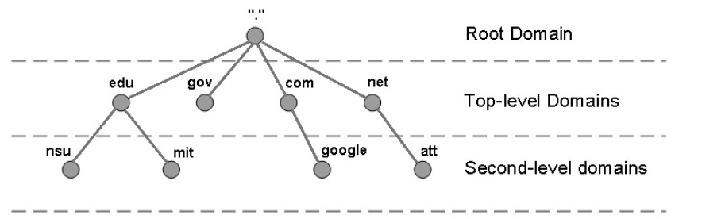   
   DNS 可以使用 UDP 或者 TCP 进行传输，使用的端口号都为 53。大多数情况下 DNS 使用 UDP 进行传输，这就要求域名解析器和域名服务器都必须自己处理超时和重传从而保证可靠性。在两种情况下会使用 TCP 进行传输：  
     * 如果返回的响应超过的 512 字节（UDP 最大只支持 512 字节的数据）。
     * 区域传送（区域传送是主域名服务器向辅助域名服务器传送变化的那部分数据）。
2. 文件传送协议
   * FTP 使用 TCP 进行连接，它需要两个连接来传送一个文件：
     * 控制连接：服务器打开端口号 21 等待客户端的连接，客户端主动建立连接后，使用这个连接将客户端的命令传送给服务器，并传回服务器的应答。
     * 数据连接：用来传送一个文件数据。
   * 根据数据连接是否是服务器端主动建立，FTP 有主动和被动两种模式：
     * 主动模式：服务器端主动建立数据连接，其中服务器端的端口号为 20，客户端的端口号随机，但是必须大于 1024，因为 0~1023 是熟知端口号。   
         
     * 被动模式：客户端主动建立数据连接，其中客户端的端口号由客户端自己指定，服务器端的端口号随机。   
       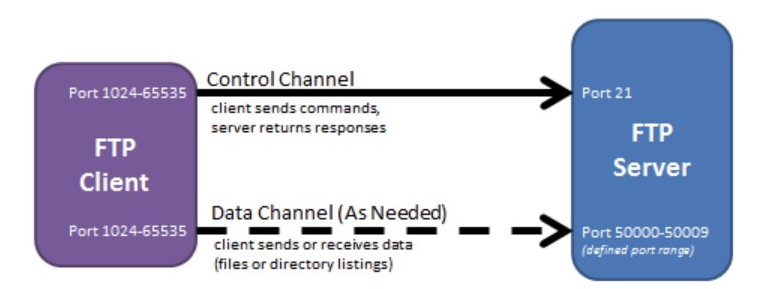  
3. 动态主机配置协议
    * DHCP (Dynamic Host Configuration Protocol) 提供了即插即用的连网方式，用户不再需要手动配置 IP 地址等信息。
    * DHCP 配置的内容不仅是 IP 地址，还包括子网掩码、网关 IP 地址。
    * DHCP 工作过程如下：
      * 客户端发送 Discover 报文，该报文的目的地址为 255.255.255.255:67，源地址为 0.0.0.0:68，被放入 UDP 中，该报文被广播到同一个子网的所有主机上。如果客户端和 DHCP 服务器不在同一个子网，就需要使用中继代理。
      * DHCP 服务器收到 Discover 报文之后，发送 Offer 报文给客户端，该报文包含了客户端所需要的信息。因为客户端可能收到多个 DHCP 服务器提供的信息，因此客户端需要进行选择。
      * 如果客户端选择了某个 DHCP 服务器提供的信息，那么就发送 Request 报文给该 DHCP 服务器。
      * DHCP 服务器发送 Ack 报文，表示客户端此时可以使用提供给它的信息。  
        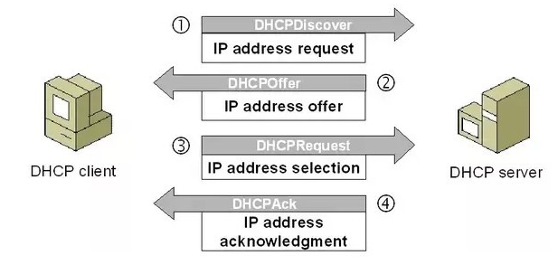     
4. 远程登录协议
   * TELNET 用于登录到远程主机上，并且远程主机上的输出也会返回。
   * TELNET 可以适应许多计算机和操作系统的差异，例如不同操作系统系统的换行符定义。
5. 电子邮件协议
   * 一个电子邮件系统由三部分组成：用户代理、邮件服务器以及邮件协议。
   * 邮件协议包含发送协议和读取协议，发送协议常用 SMTP，读取协议常用 POP3 和 IMAP。  
     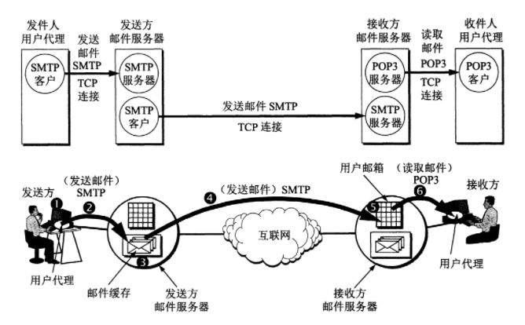   
   * SMTP：SMTP 只能发送 ASCII 码，而互联网邮件扩充 MIME 可以发送二进制文件。MIME 并没有改动或者取代 SMTP，而是增加邮件主体的结构，定义了非 ASCII 码的编码规则
   * POP3：POP3 的特点是只要用户从服务器上读取了邮件，就把该邮件删除。但最新版本的 POP3 可以不删除邮件。
   * IMAP：IMAP 协议中客户端和服务器上的邮件保持同步，如果不手动删除邮件，那么服务器上的邮件也不会被删除。IMAP 这种做法可以让用户随时随地去访问服务器上的邮件。
6. 常用端口
   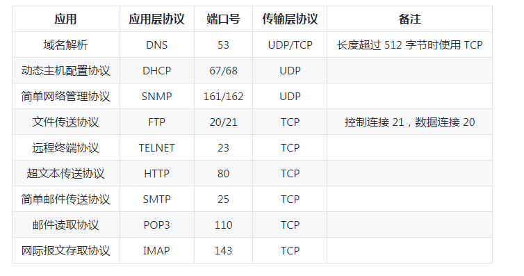 
7. Web 页面请求过程
    * DHCP 配置主机信息
      * 假设主机最开始没有 IP 地址以及其它信息，那么就需要先使用 DHCP 来获取。
      * 主机生成一个 DHCP 请求报文，并将这个报文放入具有目的端口 67 和源端口 68 的 UDP 报文段中。
      * 该报文段则被放入在一个具有广播 IP 目的地址(255.255.255.255) 和源 IP 地址（0.0.0.0）的 IP 数据报中。
      * 该数据报则被放置在 MAC 帧中，该帧具有目的地址 FF:<zero-width space>FF:<zero-width space>FF:<zero-width space>FF:<zero-width space>FF:FF，将广播到与交换机连接的所有设备。
      * 连接在交换机的 DHCP 服务器收到广播帧之后，不断地向上分解得到 IP 数据报、UDP 报文段、DHCP 请求报文，之后生成 DHCP ACK 报文，该报文包含以下信息：IP 地址、DNS 服务器的 IP 地址、默认网关路由器的 IP 地址和子网掩码。该报文被放入 UDP 报文段中，UDP 报文段有被放入 IP 数据报中，最后放入 MAC 帧中。
      * 该帧的目的地址是请求主机的 MAC 地址，因为交换机具有自学习能力，之前主机发送了广播帧之后就记录了 MAC 地址到其转发接口的交换表项，因此现在交换机就可以直接知道应该向哪个接口发送该帧。
      * 主机收到该帧后，不断分解得到 DHCP 报文。之后就配置它的 IP 地址、子网掩码和 DNS 服务器的 IP 地址，并在其 IP 转发表中安装默认网关。
    * ARP 解析 MAC 地址
      * 主机通过浏览器生成一个 TCP 套接字，套接字向 HTTP 服务器发送 HTTP 请求。为了生成该套接字，主机需要知道网站的域名对应的 IP 地址。
      * 主机生成一个 DNS 查询报文，该报文具有 53 号端口，因为 DNS 服务器的端口号是 53。
      * 该 DNS 查询报文被放入目的地址为 DNS 服务器 IP 地址的 IP 数据报中。
      * 该 IP 数据报被放入一个以太网帧中，该帧将发送到网关路由器。
      * DHCP 过程只知道网关路由器的 IP 地址，为了获取网关路由器的 MAC 地址，需要使用 ARP 协议。
      * 主机生成一个包含目的地址为网关路由器 IP 地址的 ARP 查询报文，将该 ARP 查询报文放入一个具有广播目的地址（FF:<zero-width space>FF:<zero-width space>FF:<zero-width space>FF:<zero-width space>FF:FF）的以太网帧中，并向交换机发送该以太网帧，交换机将该帧转发给所有的连接设备，包括网关路由器。
      * 网关路由器接收到该帧后，不断向上分解得到 ARP 报文，发现其中的 IP 地址与其接口的 IP 地址匹配，因此就发送一个 ARP 回答报文，包含了它的 MAC 地址，发回给主机。
    * DNS 解析域名
      * 知道了网关路由器的 MAC 地址之后，就可以继续 DNS 的解析过程了。
      * 网关路由器接收到包含 DNS 查询报文的以太网帧后，抽取出 IP 数据报，并根据转发表决定该 IP 数据报应该转发的路由器。
      * 因为路由器具有内部网关协议（RIP、OSPF）和外部网关协议（BGP）这两种路由选择协议，因此路由表中已经配置了网关路由器到达 DNS 服务器的路由表项。
      * 到达 DNS 服务器之后，DNS 服务器抽取出 DNS 查询报文，并在 DNS 数据库中查找待解析的域名。
      * 找到 DNS 记录之后，发送 DNS 回答报文，将该回答报文放入 UDP 报文段中，然后放入 IP 数据报中，通过路由器反向转发回网关路由器，并经过以太网交换机到达主机。
    * HTTP 请求页面
      * 有了 HTTP 服务器的 IP 地址之后，主机就能够生成 TCP 套接字，该套接字将用于向 Web 服务器发送 HTTP GET 报文。
      * 在生成 TCP 套接字之前，必须先与 HTTP 服务器进行三次握手来建立连接。生成一个具有目的端口 80 的 TCP SYN 报文段，并向 HTTP 服务器发送该报文段。
      * HTTP 服务器收到该报文段之后，生成 TCP SYN ACK 报文段，发回给主机。
      * 连接建立之后，浏览器生成 HTTP GET 报文，并交付给 HTTP 服务器。
      * HTTP 服务器从 TCP 套接字读取 HTTP GET 报文，生成一个 HTTP 响应报文，将 Web 页面内容放入报文主体中，发回给主机。
      * 浏览器收到 HTTP 响应报文后，抽取出 Web 页面内容，之后进行渲染，显示 Web 页面。
     
